# Testing for Milestone 4 project - Slovak shop  

1. [Continuous testing](#continuous-testing)
2. [User story testing](#user-testing)
    1. [Returning user](#returning-user)
    2. [New user](#new-user)
    3. [Administrator](#administrator)
3. [Browser and device testing]
4. [Lighthouse](#lighthouse)
5. [HTML](#html-validator)
6. [CSS Validator](#css-validator)
7. [JS Hint](#js-hint)
8. [Python linter](#python-linter)
9. [Bugs](#bugs)
10. [Additional testing](#additional-testing)

## Continuous testing

The code was tested at every commit and implementation using user stories as a guidance. Utmost care was given to every detail that could be amended and fixed.

A Python linter was also used to identify issues with the code as they arose and the debug setting allowed me to inspect any issues in the moment.

Due to the extent of the number of files with potential code to test, I have opted to forego manual validators such as those used for HTML, CSS and Python and trusted in the Linter instead, as it pulls from the latest guidance. The only problem I didn't fix in the linter is that of lines of code being too long - as I deemed that unnecessary in every case I reviewed.

## User story testing

### Returning user

#### Retain my details for future checkout

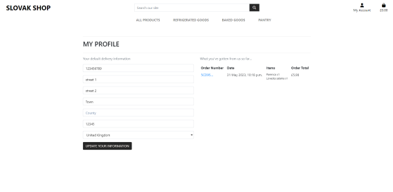

The user is able to both re-use previous data and update it when needed.

A future development could be the use of multiple addresses - billing and delivery.

#### Have an order history

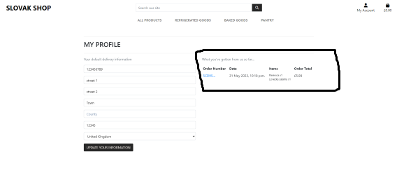

The order history is clearly presented and the details of the order are easily clickable by the user. The user is also alerted when clicking on a past order with a message so they do not get confused.

#### Ability to update my details

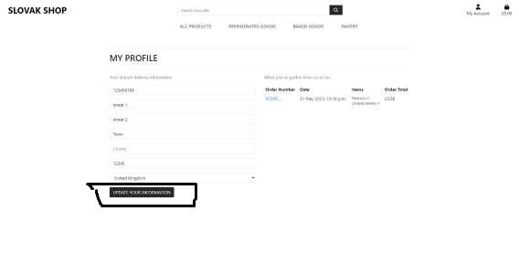

As mentioned above, the user is able to edit their profile and the information the store hold on them - including deleting useless information.

### New user

#### Find items easily

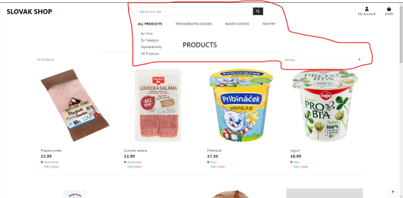

The products are clearly categorised and are sortable by name and price.

#### Add items to a cart

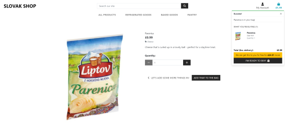

The user is able to easily add items to the cart from the product detail, and is able to select quantity at the same time.

#### Pay seamlessly

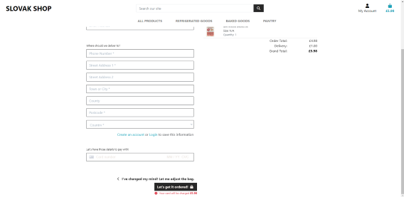

The user can pay using the Stripe integration.

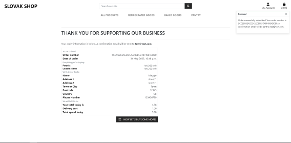

The order is confirmed by a pop-up message which also specifies next steps.

#### Receive news of new products

This was unfortunately not achieved in the time that I was doing this project.  

### Administrator

#### Add products

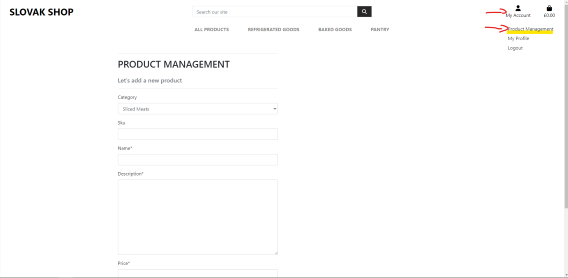

An administrator can easily add new products to the site.

#### Edit products

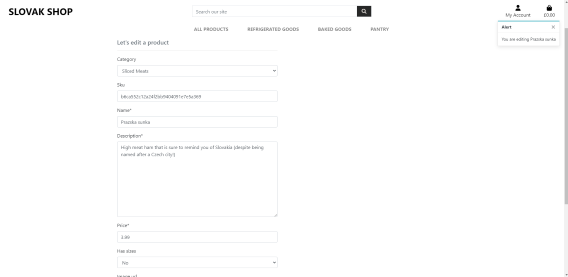

An administrator can edit products, including all fields.

#### Delete products

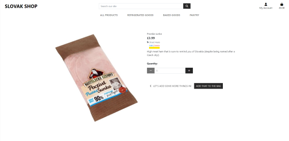

An administrator can delete products. accidental deletion is checked.

## Browser and device testing

The site was tested on a physical Google Pixel device, a virtual iPhone 12 device and both Chrome and Edge browsers. No issues encountered.

## Lighthouse

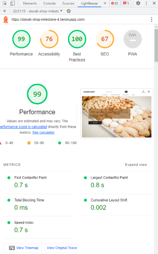

Lighthouse testing revealed issues only with Accessibility. This was strange, because I fully expected the image header to have poor contrast, however this was not the case and the menu colour contrast was deemed the biggest issue.

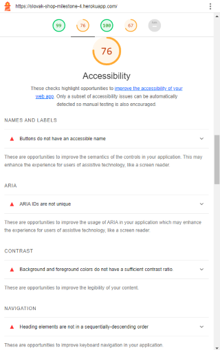

While I could change this quite easily, I have opted not to.

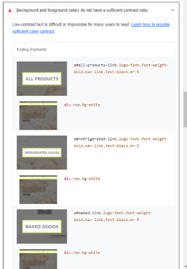

Further issues flagged were with image caching, namely the homepage-image file (which was deemed too large) and two files that are a part of the Stripe integration, and therefore I have no control over.

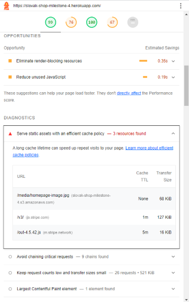

Overall, I am really satisfied with this.

## [HTML Validator](https://validator.w3.org/nu/#textarea)

The HTML validator did not generally like URL's that were formatted with curly brackets, and disliked the extending of base.html as it eliminated the need for a Doctype and other standard features. I have chosen to ignore this.

## [CSS Validator](https://jigsaw.w3.org/css-validator/validator)

The CSS Validator found no major errors with my base CSS file.

## [JS Hint](https://jshint.com/)

JS Hint only found a couple of errors with the usage of certain outdated bits of code, however this was part of the standard Stripe code and therefore I didn't amend it.

## Python linter

The Python linter used did not like the length of certain lines, however in most cases, these are complex call back lines with keys embedded, and therefore I chose not to break them up, as I didn't want to unintentionally cause the code to be illegible.

## Bugs

Overall, I really struggled with the clash of bootstrap, django and custom styling. It would seemingly choose which to pick at random and I was forced to use a lot of !important which I prefer to avoid.

### Significant usage of walkthrough code

With my best efforts, I was not able to not apply Size in the product model, despite not needing to use it, so I had to copy over code from the tutorial for bag.html, quantity_input_script.html and views.py on 28th May 2023, 15:28 as the omission of this variable caused many issues. [Commit log](https://github.com/mutkovicova/milestone-4-project/commit/eb505f3e9d87589e0668ea1bfbc325491253f0a0)

I attempted to resolve this over a 4 hour span but due to time constraints, had to abandon the problem.

### Stripe payments integration & emails

Following the walkthrough, I do believe Stripe updated the documentation and in the future, I will make sure to familiarise myself with their recommended route. For the purposes of this project, I have decided to follow the walkthrough code.
I also believe this is why emails are not sending from the platform. Whether I was using a checkout page or even a contact page which had nothing to do with Stripe, the email function would load through stripe and if it didn't receive a response back, would time out.

### Deleting an item from database while in basket

A seemingly known bug occurs if a user tries to delete a product from the shop while that product is in the checkout bag. It will trigger a full Django meltdown that says 'No Product found' and refuse to load anything else.  
Should this happen, Go to DevTools -> Applications -> Cookies -> Session.id and delete the session. This will reset the interface and allow you to continue working.

### Background image in subsites

For some reason, while on Heroku, the background image will load on all sites, including those that did not require it. I tried to mitigate this with a separate class for the homepage but it somehow still pops up! The local version did not have this issue.
I tried to both separate the classes, I tried to override the background using an !important in the FAQ CSS file that both the contact and FAQ pages use.

Contact page on local

Contact page on Heroku

### Contact us form

I originally attempted using a django contact form app [ccnmtl django-contact-us GitHub](https://github.com/ccnmtl/django-contact-us) but this app does not work within Django, despite copious troubleshooting. I believe the issue may stem from the smtp of this site being blocked by Stripe as previously identified.

I ended up following a simple tutorial using a Django built in form function to create a simple contact form from scratch within the site (all credit to [Mailtrap blog](https://mailtrap.io/blog/django-contact-form/))

## Additional testing

I have asked friends to test the app and try to act like a shopper. They had no issues, although it was a short time before submission due to Heroku platform issues.
